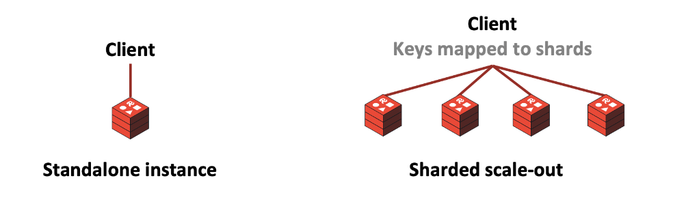
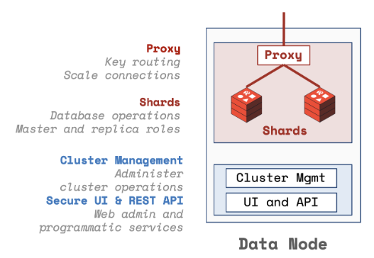
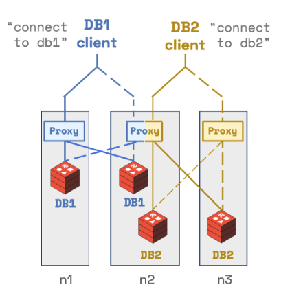

# Redis cluster



- Redis is built to be scaled horizontally using sharding
- Hash slot partitioning is used to distribute keys across shards (not called consistent hashing)
- Each shard gets a range of the hash slots (0-16383)
- Redis supports replication with master-slave
  - Master can do writes and reads
  - Slave can only do reads
- Example for 6 node setup with 3 master and 3 slaves

```text
                             Clients
                                │
          ┌─────────────────────┼───────────────────────┐
          ▼                     ▼                       ▼
   ┌───--─────────┐   ┌──────────────────┐   ┌───────────────────┐
   │   Master A   │   │     Master B     │   │      Master C     │
   │ slots 0-5460 │   │ slots 5461-10922 │   │ slots 10923-16383 │
   └──────▲───────┘   └─────────▲────────┘   └──────────▲────────┘
          │                     │                       │
   ┌──────┴───────┐   ┌─────────┴───────┐   ┌───────────┴─────────┐
   │    Slave A   │   |      Slave B    │   │        Slave C      │
   └──────────────┘   └─────────────────┘   └─────────────────────┘
```

## Redis native cluster

- Client is cluster-aware, which means that it is **responsible** for routing requests to the correct shard
- Client must update its view of the cluster topology when a failover occurs
- Redis cluster provides automatic failover and master-slave management

## Redis enterprise



- Redis Software (enterprise) wraps some of the complexity of managing a Redis cluster
- Each Readis node has two components:
  - Data access path (master and slave)
  - Management path (proxy, REST API, cluster management)



- Redis enterprise provides sharding and routing transparently to the client with a proxy
  - Each node proxy knows how to route requests to the correct shard

## Redis cluster example

Navigate to [redis-cluster](../redis-cluster) and execute the following command:

```bash
❯ ./manage-cluster.sh start
```

The local cluster should start and an output that is similar to what is shown bellow:

```bash
📊 Redis Cluster Status:
========================
Cluster Info:
cluster_state:ok
cluster_slots_assigned:16384
cluster_slots_ok:16384
cluster_slots_pfail:0
cluster_slots_fail:0
cluster_known_nodes:6
cluster_size:3
cluster_current_epoch:6
cluster_my_epoch:1
cluster_stats_messages_ping_sent:386
cluster_stats_messages_pong_sent:384
cluster_stats_messages_sent:770
cluster_stats_messages_ping_received:379
cluster_stats_messages_pong_received:385
cluster_stats_messages_meet_received:5
cluster_stats_messages_received:769
total_cluster_links_buffer_limit_exceeded:0

Cluster Nodes:
87607704bf12101439c1b004c1c2e838861f046f 172.20.0.5:7005@17005,redis-7005 slave c143e3dee6662e40d5db315ecf9de533d7f22cae 0 1757080912560 1 connected
022c732c1275236c12e8cc685bb2448df5c90877 172.20.0.4:7003@17003,redis-7003 master - 1757080909639 1757080907122 3 connected 10923-16383
44829fcc65da8061e0e79de878dee52d2466f905 172.20.0.3:7004@17004,redis-7004 slave 022c732c1275236c12e8cc685bb2448df5c90877 0 1757080912661 3 connected
c143e3dee6662e40d5db315ecf9de533d7f22cae 172.20.0.7:7001@17001,redis-7001 myself,master - 0 0 1 connected 0-5460
6c75c4189212673f629ddb6b5a6dc527092b0c9d 172.20.0.6:7002@17002,redis-7002 master - 0 1757080912000 2 connected 5461-10922
5972aa60dc67f1f311ab7bea2e7c61b236e4cad5 172.20.0.2:7006@17006,redis-7006 slave 6c75c4189212673f629ddb6b5a6dc527092b0c9d 0 1757080912560 2 connected
```

Launch the redis-cli using the following command:

```bash
❯ ./manage-cluster.sh cli
```

From analyzing the output we can see that:

- 3 master nodes
  - redis-7001 (`c143e3dee6662e40d5db315ecf9de533d7f22cae`) - slot 0 to 5460
  - redis-7002 (`6c75c4189212673f629ddb6b5a6dc527092b0c9d`) - slot 5461 to 10922
  - redis-7003 (`022c732c1275236c12e8cc685bb2448df5c90877`) - slot 10923 to 16383
- 3 slave nodes
  - redis-7004 (`44829fcc65da8061e0e79de878dee52d2466f905`) - slave of redis-7003
  - redis-7005 (`87607704bf12101439c1b004c1c2e838861f046f`) - slave of redis-7001
  - redis-7006 (`5972aa60dc67f1f311ab7bea2e7c61b236e4cad5`) - slave of redis-7002


```text
16,384 slots ────────────────┐
                             │
           ┌────── Shard A ─────────┐
 0 ──5460  │  Master 7001           │
           │  Slave 7005            │
           └────────────────────────┘

           ┌────── Shard B ─────────┐
5461─10922 │  Master 7002           │
           │  Slave 7006            │
           └────────────────────────┘

           ┌────── Shard C ─────────┐
10923─16383│  Master 7003           │
           │  Slave 7004            │
           └────────────────────────┘
```


### Node failure

```bash
❯ ./manage-cluster.sh reset

❯ ./manage-cluster.sh start

# redis-7001, redis-7002 and redis-7003 are master nodes
❯ ./manage-cluster.sh cli -c "CLUSTER NODES"

87607704bf12101439c1b004c1c2e838861f046f 172.20.0.5:7005@17005,redis-7005 slave c143e3dee6662e40d5db315ecf9de533d7f22cae 0 1757080912560 1 connected
022c732c1275236c12e8cc685bb2448df5c90877 172.20.0.4:7003@17003,redis-7003 master - 1757080909639 1757080907122 3 connected 10923-16383
44829fcc65da8061e0e79de878dee52d2466f905 172.20.0.3:7004@17004,redis-7004 slave 022c732c1275236c12e8cc685bb2448df5c90877 0 1757080912661 3 connected
c143e3dee6662e40d5db315ecf9de533d7f22cae 172.20.0.7:7001@17001,redis-7001 myself,master - 0 0 1 connected 0-5460
6c75c4189212673f629ddb6b5a6dc527092b0c9d 172.20.0.6:7002@17002,redis-7002 master - 0 1757080912000 2 connected 5461-10922
5972aa60dc67f1f311ab7bea2e7c61b236e4cad5 172.20.0.2:7006@17006,redis-7006 slave 6c75c4189212673f629ddb6b5a6dc527092b0c9d 0 1757080912560 2 connected

❯ ./manage-cluster.sh cli -stop redis-7003
...

# redis-7003 is now in fail state with redis-7004 promoted to master
❯ ./manage-cluster.sh cli -c "CLUSTER NODES"

87607704bf12101439c1b004c1c2e838861f046f 172.20.0.5:7005@17005,redis-7005 slave c143e3dee6662e40d5db315ecf9de533d7f22cae 0 1757080918708 1 connected
022c732c1275236c12e8cc685bb2448df5c90877 172.20.0.4:7003@17003,redis-7003 master,fail - 1757080909639 1757080907122 3 connected
44829fcc65da8061e0e79de878dee52d2466f905 172.20.0.3:7004@17004,redis-7004 master - 0 1757080917000 7 connected 10923-16383
c143e3dee6662e40d5db315ecf9de533d7f22cae 172.20.0.7:7001@17001,redis-7001 myself,master - 0 0 1 connected 0-5460
6c75c4189212673f629ddb6b5a6dc527092b0c9d 172.20.0.6:7002@17002,redis-7002 master - 0 1757080918000 2 connected 5461-10922
5972aa60dc67f1f311ab7bea2e7c61b236e4cad5 172.20.0.2:7006@17006,redis-7006 slave 6c75c4189212673f629ddb6b5a6dc527092b0c9d 0 1757080917000 2 connected


❯ ./manage-cluster.sh start -n redis-7003
...

# redis-7003 is now back as slave
❯ ./manage-cluster.sh cli -c "CLUSTER NODES"

87607704bf12101439c1b004c1c2e838861f046f 172.20.0.5:7005@17005,redis-7005 slave c143e3dee6662e40d5db315ecf9de533d7f22cae 0 1757080946546 1 connected
022c732c1275236c12e8cc685bb2448df5c90877 172.20.0.4:7003@17003,redis-7003 slave 44829fcc65da8061e0e79de878dee52d2466f905 0 1757080946949 7 connected
44829fcc65da8061e0e79de878dee52d2466f905 172.20.0.3:7004@17004,redis-7004 master - 0 1757080945000 7 connected 10923-16383
c143e3dee6662e40d5db315ecf9de533d7f22cae 172.20.0.7:7001@17001,redis-7001 myself,master - 0 0 1 connected 0-5460
6c75c4189212673f629ddb6b5a6dc527092b0c9d 172.20.0.6:7002@17002,redis-7002 master - 0 1757080946000 2 connected 5461-10922
5972aa60dc67f1f311ab7bea2e7c61b236e4cad5 172.20.0.2:7006@17006,redis-7006 slave 6c75c4189212673f629ddb6b5a6dc527092b0c9d 0 1757080946000 2 connected
```
