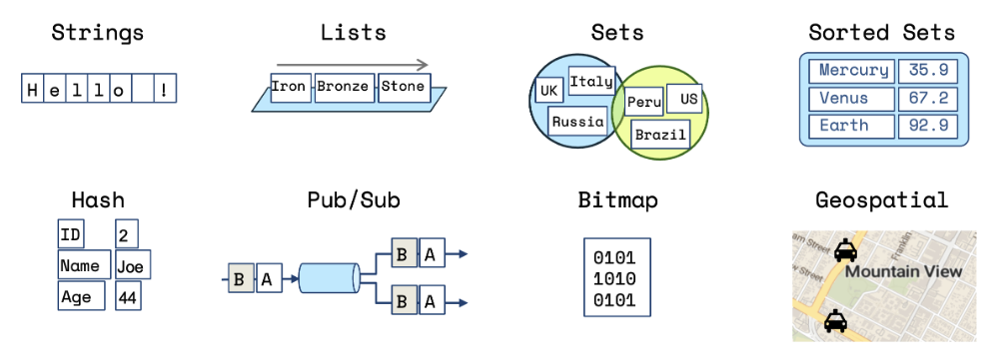

# Redis Data Types (I)



More info see [Redis data structures](https://redis.io/technology/data-structures/) page.

## Primitive Data Types

Strings are the most basic Redis data type and the foundation for all other types. Despite the name, Redis strings can store:

- **Text strings**: "Hello World"
- **Numbers**: 42, 3.14159
- **Binary data**: Images, serialized objects
- **JSON**: Serialized objects as JSON strings

**Maximum size**: 512 MB per string value

Examples here are using the Redis CLI.
To test locally use [redis-cluster](../redis-cluster) by starting the cluster and connecting to the Redis CLI:

```bash
❯ ./manage-cluster.sh start
🚀 Starting Redis cluster...
...
⏳ Waiting for cluster initialization...
✅ Redis cluster started successfully!
...

❯ ./manage-cluster.sh cli
🔌 Connecting to Redis CLI on node 7001...
127.0.0.1:7001>
```

### Set and Get

```redis
SET user:1000:name "John Doe"
SET user:1000:age 30
SET config:timeout 5000

GET user:1000:name # Returns: "John Doe"

GET user:1000:age # Returns: "30"

GET nonexistent:key # Returns: (nil)
```

#### Data manipulation

```redis
SET page:views 100

INCR page:views # Returns: 101
DECR page:views # Returns: 100
INCRBY page:views 10 # Returns: 110
DECRBY page:views 5 # Returns: 105

SET temperature 23.5
INCRBYFLOAT temperature 0.5 # Returns: "24"

SET message "Hello"
APPEND message " World" # Returns: 11 (new length)
GET message # Returns: "Hello World"
```

#### Other

```redis
APPEND key value # Append value to string
GETRANGE key start end # Get substring
GETSET key value # Set and return previous value
GETDEL key # Get and delete key
GETEX key # Get and set expiration
STRLEN key # Get string length
```

#### Multiple Key-Value

```redis
MSET user:1000:name "John" user:1000:email "john@example.com" user:1000:age 30
MGET user:1000:name user:1000:email user:1000:age # Returns: ["John", "john@example.com", "30"]
```

Preferred over multiple `SET`/`GET` commands.

#### Expiration

1 hour expiration using `EXPIRE` or `SETEX`

```redis
SET session:2000 "user_data"
EXPIRE session:2000 3600 # Expire in 3600 seconds (1 hour)

# OR

SETEX session:2000 3600 "user_data" # Equivalent to SET + EXPIRE but atomic and preferred over separate SET/EXPIRE commands
```

To check the remaining time-to-live of a key:

```redis
SET session:1000 3600 "user_data"
SETEX session:2000 3600 "user_data"

TTL session:1000 # Returns: -1 (key exists but no expiration)
TTL session:2000 # Returns: 3542 (seconds remaining)
TTL session:3000 # Returns: -2 (key doesn't exist)
```

## Time Complexity

| Command | Time Complexity | Description | Worst Case Scenario |
|---------|----------------|-------------|-------------------|
| `SET` | O(1) | Set string value | Constant time regardless of value size |
| `GET` | O(1) | Get string value | Constant time regardless of value size |
| `MSET` | O(N) | Set multiple keys | N = number of keys being set |
| `MGET` | O(N) | Get multiple keys | N = number of keys being retrieved |
| `INCR` | O(1) | Increment integer value | Constant time regardless of value size |
| `DECR` | O(1) | Decrement integer value | Constant time regardless of value size |
| `GETRANGE` | O(N) | Get substring of string | N = length of substring returned |
| `STRLEN` | O(1) | Get string length | Constant time regardless of string size |
| `APPEND` | O(1) | Append value to string | Amortized O(1), may require reallocation |
